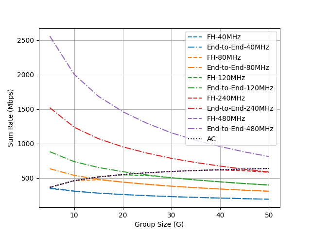
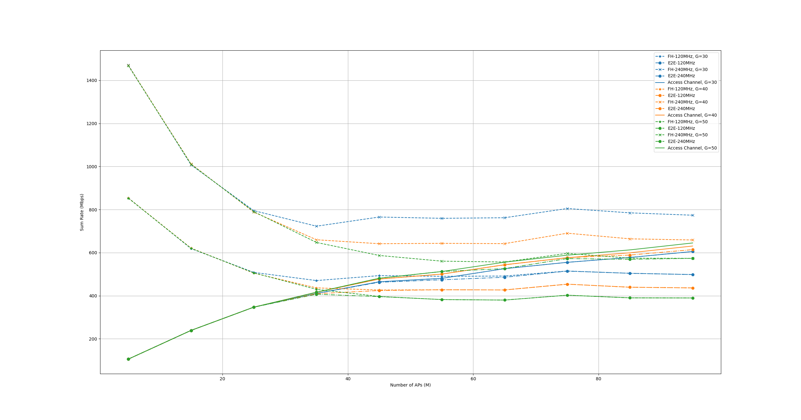
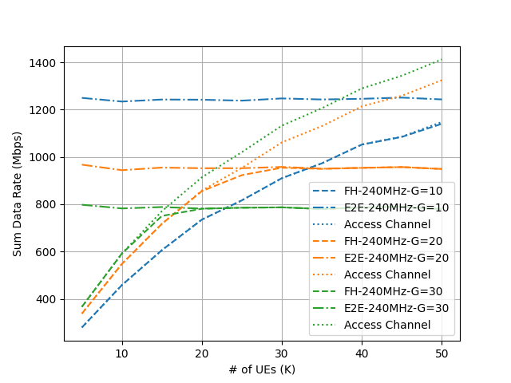
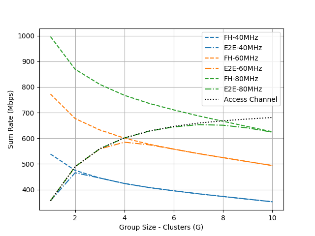

## Enabling cell-free massive MIMO systems with wireless millimeter wave fronthaul

The implementation for the simulations of the paper "[Enabling cell-free massive MIMO systems with wireless millimeter wave fronthaul](https://ieeexplore.ieee.org/abstract/document/9786576/)".

### Reproducing the Results

* The simulation parameters can be set in the main function of each individual file. Each python file to be described in the following (i) generates the data and saves it into a folder (ii) loads and plots the results.

* Run `fig_group_size.py` to generate the following figure (Fig. 5 in the paper)

* Run `fig_AP_scaling.py` to generate the following figure (Fig. 6a in the paper)

* Run `fig_UE_scaling.py` to generate the following figure (Fig. 6b in the paper)

* Run `fig_mixed_fh.py` to generate the following figure (Fig. 8 in the paper)

### Abstract

*Cell-free massive MIMO systems have promising data rate and coverage gains. These systems, however, typically rely on fiber based fronthaul for the communication between the central processing unit and the distributed access points (APs), which increases the infrastructure cost and installation complexity. To address these challenges, this paper proposes two architectures for cell-free massive MIMO systems based on wireless fronthaul that is operating at a higher-band compared to the access links. These dual-band architectures ensure high data rate fronthaul while reducing the infrastructure cost and enhancing the deployment flexibility and adaptability. To investigate the achievable data rates with the proposed architectures, we formulate the end-to-end data rate optimization problem accounting for the various practical aspects of the fronthaul and access links. Then, we develop a low-complexity yet efficient joint beamforming and resource allocation solution for the proposed architectures based on user-centric AP grouping. With this solution, we show that the proposed architectures can achieve comparable data rates to those obtained with optical fiber-based fronthaul under realistic assumptions on the fronthaul bandwidth, hardware constraints, and deployment scenarios. This highlights a promising path for realizing the cell-free massive MIMO gains in practice while reducing the infrastructure and deployment overhead.*

### License

 This code package is licensed under a [Creative Commons Attribution-NonCommercial-ShareAlike 4.0 International License](https://creativecommons.org/licenses/by-nc-sa/4.0/). 

If you in any way use this code for research that results in publications, please cite our original article:

> U. Demirhan and A. Alkhateeb, "Enabling Cell-Free Massive MIMO Systems With Wireless Millimeter Wave Fronthaul," in IEEE Transactions on Wireless Communications, vol. 21, no. 11, pp. 9482-9496, Nov. 2022, doi: 10.1109/TWC.2022.3177186.
